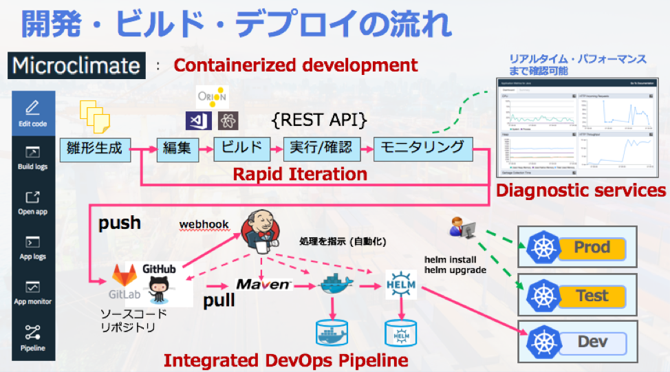
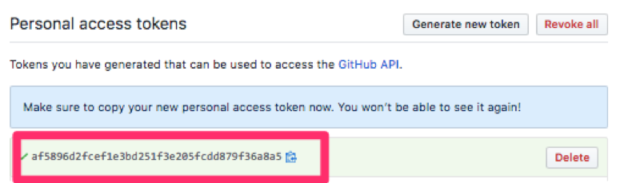

# Lab 3-1. Microclimateのセットアップ
Lab3-1ではIBM Microclimateのセットアップを行います。Microclimateは，マイクロサービスの高速開発を支援し，Kubernetesクラスターへのデプロイを支援するツールです。Microclimate自体がコンテナ(K8s)上で動作するコンポーネントであり，IBM Cloud Private (Private Kubernetes ソフトウェア。以降，ICP)上で動作させることが可能です。 
 
 

## 1.	IBM Cloud Virtual Machine (Ubuntu) に接続
以下の手順でサーバー(リモート環境のUbuntu) にログインします。
### 1-1. 	ターミナルを開きます (TeraTermなどの場合はUI上からログインできます)
### 1-2. 	手元の接続情報(IPアドレス)とPCに導入済のSSH Key(id_rsa)を使用してサーバーに接続します

```$ ssh -i id_rsa root@<IP>```

<IP>には，お手元にある自身の環境IPアドレスを指定してください。

※上記は，ターミナルなどSSHを利用する場合の例です。TeraTermなどのツールを使用する場合は，自身のIPアドレスを指定の上，sshキーを使用し，rootユーザーでログインください。

## 2.	IBM Cloud Private (Private Kubernetes) にログイン
以下の手順で，ICP に対する「CLIによるログイン」「コンソールへのログイン」を試します。「<IP>」と記載のある部分は，各自の環境情報に置き換えて手順を実施してください。
### 2-1. ターミナル上で，cloudctlコマンドを実行し，「Username」「Password」「Account」「Namespace」を入力・選択します
```# cloudctl login -a https://<IP>:8443 --skip-ssl-validation```

- Username:	`admin`
- Password:	`admin`
- Account: `1 (id-mycluster-account)`
- Namespace: `6 (kube-system)` ※kube-systemの番号を選択

### 2-2. ICP K8sクラスターへの接続をターミナル上で確認します

```# kubectl get pods --all-namespaces```

上記コマンドでICPを構成する多数のPod(コンテナ)を確認できます。

### 2-3. ブラウザでICPコンソールにログインします
- ICPコンソールURL: `https://<IP>:8443`
- ユーザー名: `admin`
- パスワード: `admin`

## 3.Helmのセットアップ
Helm は，CNCF Incuvation Projectの1つであり，クラウドネイティブ・テクノロジーの中でも注目されています。Helm は，今回構築するMicroclimateはじめ，アプリケーション(例えばマイクロサービスの組合せ)，ベンダー提供のソフトウェアやミドルウェア，OSSソリューション等，ありとあらゆるコンポーネントを導入から管理まで支援してくれる Kubernetes 向けパッケージ管理ツール です。

### 3-1. ターミナルを開き，Helmのホームディレクトリを設定します

```# export HELM_HOME=~/.helm```

### 3-2. Helm 初期設定および動作を確認します

```
# helm init --client-only
# helm version --tls
```

### 3-3. Microclimateなどibmチャート (Helm Chart) を含むリポジトリを追加します

```# helm repo add ibm-charts https://raw.githubusercontent.com/IBM/charts/master/repo/stable/```

※上記は1行で入力します

### 3-4. ibm-chartsリポジトリ および Microclimateチャートの存在有無を確認します 

```
# helm repo list
# helm search -l | grep microclimate
```

※参考:
ICP Kubernetesクラスターは多数のHelm Chartを使用して構成されています。
以下のコマンドで確認できます。
```
# helm ls --tls
NAME                                           	REVISION	UPDATED                 	STATUS  	CHART                           	NAMESPACE
audit-logging                                  	1       	Mon Sep 24 10:38:36 2018	DEPLOYED	audit-logging-3.1.0             	kube-system
auth-apikeys                                   	1       	Mon Sep 24 10:32:00 2018	DEPLOYED	auth-apikeys-3.1.0              	kube-system
auth-idp                                       	1       	Mon Sep 24 10:31:57 2018	DEPLOYED	auth-idp-3.1.0                  	kube-system
auth-pap                                       	1       	Mon Sep 24 10:32:03 2018	DEPLOYED	auth-pap-3.1.0                  	kube-system
auth-pdp                                       	1       	Mon Sep 24 10:32:06 2018	DEPLOYED	auth-pdp-3.1.0                  	kube-system
calico                                         	1       	Mon Sep 24 10:29:11 2018	DEPLOYED	calico-3.1.0                    	kube-system
catalog-ui                                     	1       	Mon Sep 24 10:36:26 2018	DEPLOYED	icp-catalog-chart-3.1.0         	kube-system
cert-manager                                   	1       	Mon Sep 24 10:30:19 2018	DEPLOYED	ibm-cert-manager-3.1.0       cert-manager
custom-metrics-adapter                         	1       	Mon Sep 24 10:35:32 2018	DEPLOYED	ibm-custom-metrics-adapter-3.1.0	kube-system
heapster                                       	1       	Mon Sep 24 10:35:20 2018	DEPLOYED	heapster-3.1.0                  	kube-system
helm-api                                       	1       	Mon Sep 24 10:36:29 2018	DEPLOYED	helm-api-3.1.0                  	kube-system
helm-repo                                      	1       	Mon Sep 24 10:35:23 2018	DEPLOYED	helm-repo-3.1.0                 	kube-system
icp-management-ingress                         	1       	Mon Sep 24 10:32:09 2018	DEPLOYED	icp-management-ingress-3.1.0    	kube-system
image-security-enforcement                     	1       	Mon Sep 24 10:35:25 2018	DEPLOYED	ibmcloud-image-enforcement-3.1.0	kube-system
kube-dns                                       	1       	Mon Sep 24 10:29:14 2018	DEPLOYED	kube-dns-3.1.0                  	kube-system
logging                                        	1       	Mon Sep 24 10:35:40 2018	DEPLOYED	ibm-icplogging-2.0.0            	kube-system
mariadb                                        	1       	Mon Sep 24 10:30:43 2018	DEPLOYED	mariadb-3.1.0                   	kube-system
metering                                       	1       	Mon Sep 24 10:35:29 2018	DEPLOYED	metering-3.1.0                  	kube-system
metrics-server                                 	1       	Mon Sep 24 10:30:49 2018	DEPLOYED	metrics-server-3.1.0            	kube-system
mgmt-repo                                      	1       	Mon Sep 24 10:38:24 2018	DEPLOYED	mgmt-repo-3.1.0                 	kube-system
mongodb                                        	1       	Mon Sep 24 10:30:29 2018	DEPLOYED	icp-mongodb-3.0.0               kube-system
monitoring                                     	1       	Mon Sep 24 10:36:21 2018	DEPLOYED	ibm-icpmonitoring-1.2.0       kube-system
nginx-ingress                                  	1       	Mon Sep 24 10:30:40 2018	DEPLOYED	nginx-ingress-3.1.0             	kube-system
nvidia-device-plugin                           	1       	Mon Sep 24 10:30:22 2018	DEPLOYED	nvidia-device-plugin-3.1.0    kube-system
platform-api                                   	1       	Mon Sep 24 10:30:46 2018	DEPLOYED	platform-api-3.1.0              	kube-system
platform-ui                                    	1       	Mon Sep 24 10:35:37 2018	DEPLOYED	platform-ui-3.1.0               	kube-system
secret-watcher                                 	1       	Mon Sep 24 10:38:28 2018	DEPLOYED	secret-watcher-3.1.0            	kube-system
security-onboarding                            	1       	Mon Sep 24 10:38:31 2018	DEPLOYED	security-onboarding-3.1.0     kube-system
service-catalog                                	1       	Mon Sep 24 10:30:37 2018	DEPLOYED	service-catalog-3.1.0           	kube-system
unified-router                                 	1       	Mon Sep 24 10:36:18 2018	DEPLOYED	unified-router-3.1.0            	kube-system
```


## 4.	Microclimate のセットアップ
Microclimateをインストールする際に必要となる事前準備を行います。

### 4-1. Microclimate自体を動作させるためのNamespaceを作成します

```# kubectl create namespace microclimate```

### 4-2. Microclimate Pipeline (Jenkinsベースの自動化ステップ) によってデプロイされるマイクロサービスを動作させるためのNamespaceを作成します	
```# kubectl create namespace microclimate-pipeline-deployments```

### 4-3. Docker registryのsecretをMicroclimate用に作成します

```# kubectl create secret docker-registry microclimate-registry-secret --docker-server=mycluster.icp:8500 --docker-username=admin --docker-password=admin --docker-email=null --namespace=microclimate```


> [Hint]
>
>kubectlコマンド実行時のNamespaceを事前にcontextに設定しておくことで，各種リソース作成などの操作時にNamespaceの指定を省略できます。以下のコマンドを実行します。
>
>実行例: 
>
>```# kubectl config set-context $(kubectl config current-context) --namespace microclimate```
>
>before: 実行コマンド) ```# kubectl get pods --namespace microclimate```
>
>after: 実行コマンド) ```# kubectl get pods```

### 4-4. Docker registryのSecretをMicroclimate Pipeline用に作成します

```# kubectl create secret docker-registry microclimate-pipeline-secret   --docker-server=mycluster.icp:8500 --docker-username=admin --docker-password=admin --docker-email=null --namespace=microclimate-pipeline-deployments```

### 4-5. Service Account "default" にSecretをパッチします
```# kubectl patch serviceaccount default --namespace microclimate-pipeline-deployments -p '{"imagePullSecrets": [{"name": "microclimate-pipeline-secret"}]}'```


### 4-6. Helmをセキュアに使用するためのSecretを作成します
```# kubectl create secret generic microclimate-helm-secret --from-file=cert.pem=$HELM_HOME/cert.pem --from-file=ca.pem=$HELM_HOME/ca.pem --from-file=key.pem=$HELM_HOME/key.pem --namespace microclimate```

### 4-7. Microclimateの永続化データ (マイクロサービスのプロジェクト，Jenkins関連のビルド・デプロイ情報など)を格納する2つのディレクトリをサーバー上に用意します

```# mkdir -p /microclimate/mc-data /microclimate/mc-jenkins```
```# chmod 777 /microclimate/mc-data /microclimate/mc-jenkins```

※参考:

受講者が利用するICP K8sクラスターは，VM1台から成るシングル構成です。このため，VM自体のhostPathを永続化領域として使用しており，直接ディレクトリを切っています。複数台から成るマルチノード構成を取る場合は，共有ディスクとしてのNFSなど他の方法で永続化領域を確保します。

### 4-8. Persistant Volume と Persistant Volume Craim を作成します
アタッチするストレージやファイルシステムを設定する定義(Persistant Volume, PV)と，K8sリソースが永続化領域を必要とした時にマッピングするための定義(Persistant Volume Craim, PVC)を作成します。

今回用意するのは，以下の2セットです。

- mc-data
    - Microclimateが管理するマイクロサービス・プロジェクトの実体を格納
- mc-jenkins
    - Jenkins Pipelineに関連するデータを格納

ICP コンソールを使用して，GUI上で以下のPV/PVCを2セットを作成します。

- (1) ブラウザで，`https://<IP>:8443` に接続します。
- (2) 「メニュー > プラットフォーム > ストレージ」を開きます。

    
 
- (3) mc-data用のPVを作成します。
    - 一般 > 名前: `mc-data`
	- 一般 > 容量: `8 Gi`
	- 一般 > アクセスモード: `何度でも読み取り/書き込み`
	- 一般 > ストレージ・タイプ: `ホスト・パス`
    - パラメーター > キー: `path`
    - パラメーター > 値: `/microclimate/mc-data`

    ※必要に応じて以下図を参考にしてください
    

    

    

    

- (4) mc-data 用の PVC を作成します。
	- 名前: `mc-data`
	- 名前空間: `microclimate`
	- ストレージ要求: `8 Gi`
	- アクセスモード: `何度でも読み取り/書き込み`
    
    ※必要に応じて以下図を参考にしてください
    
    

    

    

次に，mc-jenkinsについても，ｍc-dataと同様に，PVとPVCを作成します。

- (5) mc-jenkins 用の PV を作成します。
	- 一般 > 名前: `mc-jenkins`
	- 一般 > 容量: `8 Gi`
	- 一般 > アクセスモード: `一度だけの読み取り/書き込み`
	- 一般 > ストレージ・タイプ: `ホスト・パス`
    - パラメーター > キー: `path`
    - パラメーター > 値: `/microclimate/mc-jenkins`
- (6) mc-jenkins 用の PVC を作成します。
	- 名前: `mc-jenkins`
	- 名前空間: `microclimate`
	- ストレージ要求: `8 Gi`
	- アクセスモード: `一度だけの読み取り/書き込み`

### 4-9. ClusterImagePolicyを編集して以下Dockerイメージをpullできるようにします
以下の3つを末尾に追加します
- name: docker.io/maven:*
- name: docker.io/lachlanevenson/k8s-helm:*
- name: docker.io/jenkins/*

kubectl edit実行画面: 

`# kubectl edit clusterimagepolicy ibmcloud-default-cluster-image-policy`

```
以下実行結果の例

  - ・・・・・・
  - ・・略・・・
  - ・・・・・・
  - name: docker.io/nginx:*
  - name: docker.io/open-liberty:* 
  - ・・・・・・
  - ・・略・・・
  - ・・・・・・
  - name: registry.bluemix.net/armada-master/ibm-worker-recovery:*
  - name: docker.io/maven:*
  - name: docker.io/lachlanevenson/k8s-helm:*
  - name: docker.io/jenkins/*

末尾3行を追加します。 (※インデントは，他の "- name"の項目に合わせてください )
```
 
## 5. Microclimate のデプロイ
"ibm-microclimate" チャートを使用して，MicroclimateをIBM Cloud Private (Private Kubernetes)上にデプロイします。ProxyノードのIPアドレスを使用しますので確認してください。

※今回はシングルノード構成のため，単一のIPアドレスです。「# kubectl get nodes」 で確認できます。

### 5-1. ProxyノードのIPアドレスを確認します
```
# kubectl get nodes
NAME            STATUS    ROLES                                 AGE       VERSION
169.62.93.163   Ready     etcd,management,master,proxy,worker   15h       v1.11.1+icp-ee
```

> [Hint]
>
>Boot，Master，Proxy，Worker，Management，VA，etcd，など複数のノードでK8sクラスターを構成している場合は，以下のコマンドでProxyノードのIPアドレスを見つけることができます。
> 
> 実行例:
> 
> ```# kubectl get nodes -l proxy=true -o yaml | grep -B 1 ExternalIP```
 
### 5-2. Microclimate をデプロイします
MicroclimateおよびPipeline(Jenkins)は，ProxyノードのIPアドレスを使ってIngress経由で外部公開されます。前の手順で取得したProxyノードのIPアドレスを以下のコマンド実行時に置き換えます。

実行例 (以下は169.62.93.163のマシンの場合の例):

```# helm install --name microclimate --namespace microclimate --set global.rbac.serviceAccountName=micro-sa,jenkins.rbac.serviceAccountName=pipeline-sa,hostName=microclimate.169.62.93.163.nip.io,jenkins.Master.HostName=jenkins.169.62.93.163.nip.io,persistence.existingClaimName=mc-data,jenkins.Persistence.ExistingClaim=mc-jenkins,jenkins.Pipeline.TargetNamespace=microclimate-pipeline-deployments ibm-charts/ibm-microclimate --tls```

### 5-3. 各種コンソール画面に接続できることを確認する
IPアドレス部分は，自身の環境のものと置き換えてください。

ブラウザでICPコンソールのURLを開きます。
- ICPコンソール: `https://169.62.93.163:8443`
- ユーザー名: `admin`
- パスワード: `admin`
	
ブラウザで Microclimateのポータルを開きます。
- MicroclimateデプロイURL: `https://microclimate.169.62.93.163.nip.io/`


ブラウザで Jenkinsサーバーの画面を開きます。
- Jenkins サーバーURL: `https://jenkins.169.62.93.163.nip.io/`


以下は，３つの画面のログイン後の状態です。

※ログインが正常にできればOKです。以前の使用状況に合わせて初期状態の画面が異なる場合があります。

図: ICP コンソール


図: Microclimate ポータル 


図: Jenkins サーバー画面 


## 6. GitHubアカウントの準備
3つの手順を実施します。

- GitHubアカウントを作成 (既に所有している方は不要)
- GitHubアカウントのPersonalAccessTokenを作成
- 新規リポジトリを作成

### 6-1. GitHubアカウントを作成します
[GitHub.com](https://github.com/) にアクセスして，Sign upします。

※既にGitHubアカウントを所有している場合は，新規作成する必要はありません。

### 6-2. GitHubアカウント作成後に，Personal Access Tokenを発行します
ログイン後，「ユーザーアイコン > Setting > Developer setting > Generate new token」を選択します。


Token descriptionにトークンの用途がわかるように任意の名前を指定します。


トークンを使用して操作可能にするスコープに対してチェックを入れます。

※今回は，以下図のように指定してください。
- repo 
- admin: repo_hook
- delete_repo


上図の「Generate token」を選択します。

次の画面で，Personal Access Token の文字列が表示されますので，メモ帳などにコピーアンドペーストしておいてください。

※注意:

一度きりしか表示されないため，忘れてしまった場合は再度作成することになります


### 6-3. GitHub.comのトップページなどの「New repository」から新規にリポジトリを作成します
 

任意の名前を「Repository name」に入力し，他はデフォルトの状態のまま，「Create repository」を選択します。

※注意:

この後の手順で，新規にマイクロサービス・プロジェクトを作成しますが，このタイミングで作成した「Repository name」と同一名とする必要があります。後で使用しますのでメモをとっておいてください。

※参考:

本ドキュメント内では，「cnhandsonapp」という名前のリポジトリを作成し，後に作成するマイクロサービスも同様の名前で作成しています。


 
以上で，開発およびCI/CDツールである Microclimateの構築と，GitHubアカウントの準備が整いました。
