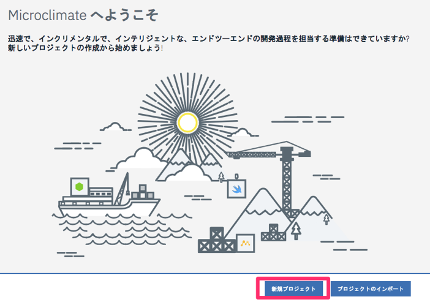
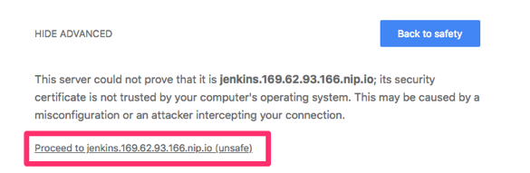
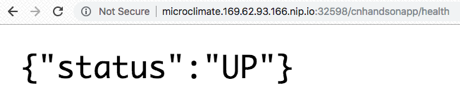

# Lab 3-2. マイクロサービスの新規作成とICP (Kubernetes)上へのデプロイ
Lab3-2では，新規にマイクロサービスを作成します。Lab3-1でセットアップしたMicroclimateを使用して作成し，GitHubリポジトリ上にpushします。最終的には，ICP Kubernetes クラスター上にマイクロサービスを自動デプロイします。

## 1. Microclimateでマイクロサービスを作成
### 1-1. Microclimateポータルにログインします
ブラウザで Microclimateのポータルを開きます。
- MicroclimateデプロイURL: `https://microclimate.169.62.93.163.nip.io/`
- ユーザー名: `admin`
- パスワード: `admin`

    ※IPアドレス部分は自身の環境のものに置き換えてください

### 1-2. 「新規プロジェクト」を選択します


### 1-3. 「Java」を選択し，プロジェクト名として「cnhandsonapp」を指定します

※注意

プロジェクト名は，GitHubで作成したリポジトリ名と同一にしてください。


### 1-4. 「Microprofile/Java EE」を選択して，「作成」と進みます

 
### 1-5. 作成したcnhandsonappプロジェクトのステータスが「ビルド中」から「実行中」に変わるまで待ちます


## 2. GitHubリポジトリにマイクロサービスをpush
前の手順で作成したマイクロサービスを自身のGitHubリポジトリにpushします。

### 2-1. Microclimateの左メニューから 「コードの編集」を選択します


※注意

画面が真っ白(WebIDEが表示されない状態)になった場合は，ブラウザの履歴を削除して，再度Microclimateに接続してください。

### 2-2. 「File > Open New Terminal」を選択します


### 2-3. 自身のプロジェクトにディレクトリを移動します
`# cd cnhandsonapp`


### 2-4. 作成済のGitHubリポジトリに対してpushします

`# git remote add origin https://github.com/capsmalt/cnhandsonapp`

`# git push -u origin master`

※Lab3-1の最後に作成したリポジトリへのURLに置き換えてください。
 

### 2-5. GitHubリポジトリを確認します


上図のように，Microclimateで生成されたマイクロサービス雛形プロジェクトが確認できます。
 
## 3. MicroclimateでJenkins Pipeline を構成
Microclimateを使用することで，作成したマイクロサービスを，Kubernetesクラスター(IBM Cloud Private)に対して，自動的にデプロイさせることができます。具体的には，Microclimateを通じて，Jenkins Pipelineを構成します。

### 3-1. Microclimateの左メニューから「パイプライン」を選択し，「パイプラインの作成」ボタンをクリックします。

 
### 3-2. 「パイプライン名」と「リポジトリ」を指定し，「パイプラインの作成」を開きます
- パイプライン名: `cnhandsonapppipeline (任意の名前)`

- リポジトリ: `cnhandsonapp (Lab3-1最後に作成したリポジトリ)`


### 3-3. 「パイプラインを開く」を選択します


以下のような警告が出た場合は，「ADVANCED」を展開し，「Proceed to ...」を開きます。



 
### 3-4. Jenkinsの管理画面に遷移し，masterブランチ(GitHub)のビルド状況が表示されますので，続けて「master」を選択します


### 3-5. Pipeline の進行状況を確認します
Jenkins Pipelineが動作し，以下5つのステージが順に実行されているはずです。

(最後まで到達するまでに5分ほどかかります)

1. 「Extract(ソースコード抽出)」
2. 「Maven Build(ビルド)」
3. 「Docker Build(イメージ作成)」
4. 「Verify(簡易テスト)」
5. 「Notify DevOps(通知，デプロイ)」


### 3-6. 各ステージの中身を確認してみます
実際の動作は，以下のGitHub上にある定義を呼び出すことで実現されています。
ユーザーは特に何も指定することなく標準的なPipelineの利用が可能です。

`https://github.com/capsmalt/jenkins-library/blob/master/vars/microserviceBuilderPipeline.groovy`

### 3-7. Microclimateのターミナルに戻り，プロジェクト内のファイルを確認します
`# ls`


### 3-8. Jenkins Pipeline の構成ファイルである「Jenkinsfile」の中身を確認します
`# cat Jenkinsfile`


プロジェクト名(image=cnhandsonapp)のみが指定されていることが分かります。
基本的には前の手順で確認したGitHub上のgroobyを呼び出すことで「5段階のステージでステップが自動化」されています。

プロジェクト内には，他にも多数のファイルが自動生成されています。

## 4. マイクロサービスのアプリケーション動作確認
実体はシンプルなREST APIアプリケーションです。Microclimate上で，動作確認をします。

### 4-1. Microclimateの左メニューから「アプリケーションを開く」を選択します 


### 4-2. URLに「〜〜〜/cnhandsonapp/v1/example/」を追加します


文字列がリターンされることを確認できます。
これは，今回自動生成したマイクロサービスはREST GETでレスポンスを返すように構成されているためです。

さらにサービスの死活監視のためのヘルスチェックは以下のように，`/health` を付与して確認できるように初期構成されています。
`http://microclimate.169.62.93.166.nip.io:32598/cnhandsonapp/health`



### 4-3. 	ターミナルでKubectl CLIでマイクロサービスのPodの動作状況を確認してみます
TeraTermなどクライアントPC上のターミナル上で実行します。
**※Microclimate上のターミナルではありません**
```
#kubectl get pods -n microclimate

NAME                                                           			　　　　　       READY     STATUS    RESTARTS   AGE
admin-microclimate-editor-5c8dd9ddbc-4xdvt                    　 	　　     2/2       Running   0          3h
admin-microclimate-filewatcher-75df68df5c-dzp5s                	           1/1       Running   0          3h
admin-microclimate-loadrunner-8567866cd-clbbs                  	           1/1       Running   0          3h
mc-cnhandsonapp-662d7100-c226-11e8-ab44-idc-55bcf8c658-4qb5s   1/1       Running   0          11h
microclimate-ibm-microclimate-66848cc6f8-fdv2l                 	          1/1       Running   2          11h
microclimate-ibm-microclimate-devops-69bd9884c5-bm9kf	                        1/1       Running   0          11h
microclimate-jenkins-6879b96bf5-k9qtk                          	                           1/1       Running   0          11h
```

デプロイ済のアプリケーションは，次のPod名で動作していることが分かりま
す。

Pod名: `mc-cnhandsonapp-662d7100-c226-11e8-ab44-idc-55bcf8c658-4qb5s`


## 5. ソースコードを更新する
REST GET で返す文字列を追加します。Example.javaを編集します。

### 5-1. Microclimateの左メニューから「コードの編集」を選択します

### 5-2. Example.javaをダブルクリックして開きます
「cnhandsonapp > src > main > java > application > rest > v1 > Example.java」


### 5-3. 図のようにコードを編集します
追加する文字列は任意のもので構いません。


### 5-4. 「Ctrl+s」で保存します

### 5-5. 自動的にビルドが走るので，上部のステータス表記が「実行中   ビルド正常終了」の状態になるまで待ちます (十数秒かかります)

 
### 5-6. ブラウザ上で動作確認します
IPアドレスやポート番号は自身の環境のものに置き換えてください。
`http://microclimate.169.62.93.166.nip.io:32598/cnhandsonapp/v1/example`


Microclimate上でコードを開発し，Saveすることで瞬時に Kubernetes 上に反映されることが確認できました。

「`# kubectl get pods -n microclimate`」で動作確認できたように，現在は Microclimateツールが動作する Namespace(=microclimate)と同じ場所で動作していることを覚えておいてください。

## 6. Microclimateから ICP上の任意のNamespaceにデプロイ
Microclimateを使用することで，作成したマイクロサービスを，Kubernetesクラスター(IBM Cloud Private)の任意のNamespaceに対してデプロイさせることができます。具体的には，Microclimateを通じて，デプロイメント定義を追加し，Jenkins Pipelineを走らせます。

### 6-1. 「パイプライン > デプロイメントの追加」を選択します

 
### 6-2. Masterブランチが選択された状態で，「保存」します

 
### 6-3. 再度「パイプラインを開く」を選択します


### 6-4. 「master」を選択して，Pipelineの進捗状況を確認します
2度目のPipeline実行が行われているはずです。(実行中の場合もあります)

 
### 6-5. ICP上でデプロイ済マイクロサービスを確認します
ブラウザでICPコンソールを開きます。
- ICPコンソール: `https://169.62.93.163:8443`
- ユーザー名: `admin`
- パスワード: `admin`

### 6-6. 「ワークロード > デプロイメント」を選択し，デプロイメント一覧を表示します


### 6-7. Namespace `"microclimate-pipeline-deployments"` に対して，本日作成したマイクロサービスがデプロイされていることを確認します


上図の2行目を参照ください。

最初は，Namespace名 `microclimate` に対して，Deployment名 ` mc-cnhandsonapp-662d7100-c226-11e8-ab44-idc` がデプロイされていました。

次に1行目を参照ください。

2回目は，Namespace名 `microclimate-pipeline-deployments` に対して，Deployment名 `cnhandsonapp-deployment` がデプロイされています。

例えば，開発する際には `microclimate` の Namespaceを使用し，テスト(あるいは本番環境)向けには，`microclimate-pipeline-deployments` を使用するなどの使い分けが考えられます。
